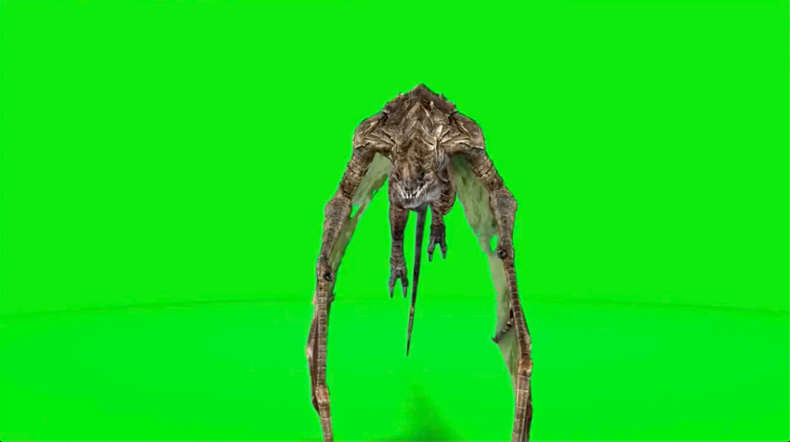

# Green-Matting
Subtracts the required foreground and adds it to the required background!

# Example:

1. Foreground:

2. Background:

3. Processed Image:

# Demo:

# Video:

[Click here for Video](demo_video.mov)

